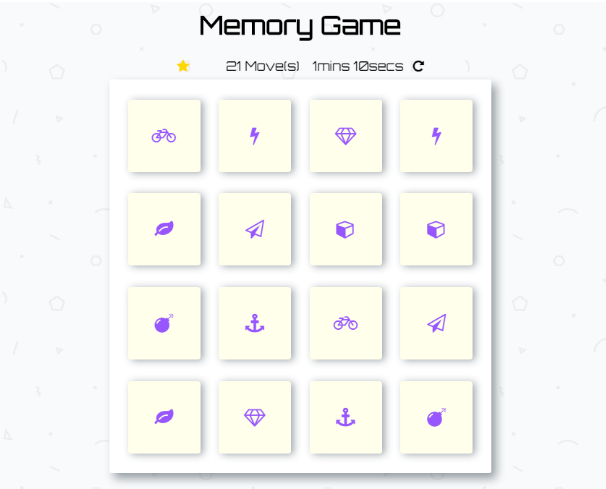

# Memory Game Project
This is a simple game built to test a users memory. There's a deck of cards with different icons. 

## Instructions

- Open https://strongsoda.github.io/memoryGame/index.html .
- Clicking on tiles will turn them over so that you can see what lies on them.
- Your goal is to match two tiles of the same type at a time.
- Then try to match all pairs in as minimum moves as possible.

## Dependencies

1. [Google Fonts](https://fonts.google.com/)
2. [Font-Awesome](https://fontawesome.com/)

## Screenshots

